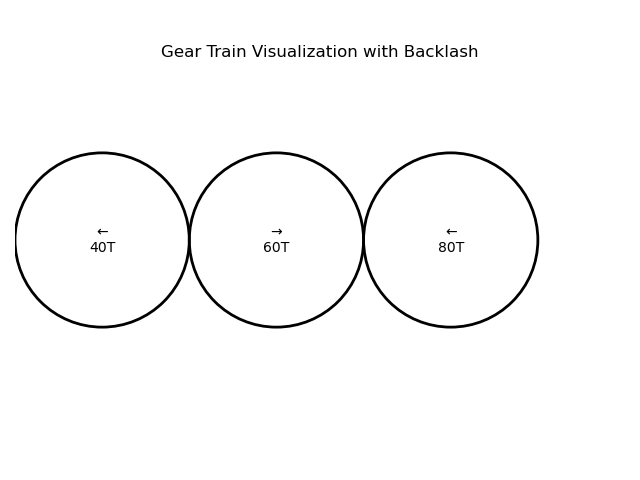

Gear Train Calculator and Visualizer with backlash simulation fully integrated

This Python project simulates a multi-stage gear train to calculate the final speed, torque, and rotation direction based on gear ratios — including realistic backlash simulation.
The tool visualizes gear connections using `matplotlib`, showing direction of each gear and saving the output as a clean PNG image.




Features

- Multi-stage gear train simulation
- Backlash simulation per gear mesh (user-defined % loss)
- Calculates:
- Output Speed (RPM)
- Output Torque (Nm)
- Output Direction (CW / CCW)
- Saves a visual output of gear connections and directions
- Simple command-line interface for user input

Files Included

- `Gear.ipynb` – Jupyter notebook with full simulation code
- `plot1.png` – Visualization of gear layout (generated when run)
- `README.md` – Project documentation
  
How to Run

1. **Install Python 3** (if not already installed)
2. Install required library:
   ```bash
   pip install matplotlib

Sample Output

Gear Train Calculator & Visualizer with Backlash 
How many gears?  3
Enter number of teeth for gear 1:  40
Enter number of teeth for gear 2:  60
Enter number of teeth for gear 3:  80
Enter input speed (RPM):  90
Enter input torque (Nm):  45
Enter input rotation direction (CW/CCW):  ccw
Enter backlash per gear mesh (as %):  2

Final Output:
Output Speed: 46.86 RPM
Output Torque: 86.44 Nm
Output Direction: CCW
Applied Backlash per Stage: 2.0%

Future Improvements
1. Dynamic animation of rotating gears
2. Export results to Excel or CSV
3. Build an interactive GUI using Streamlit or Tkinter
